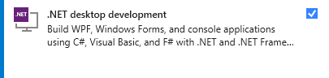

# SignToolGUI

  
  
  

  <a href="https://github.com/michaelmsonne/SignToolGUI/issues/new?assignees=&labels=bug&template=01_BUG_REPORT.md&title=bug%3A+">Report a Bug</a>
  ·
  <a href="https://github.com/michaelmsonne/SignToolGUI/issues/new?assignees=&labels=enhancement&template=02_FEATURE_REQUEST.md&title=feat%3A+">Request a Feature</a>
  .
  <a href="https://github.com/michaelmsonne/SignToolGUI/discussions">Ask a Question</a>

## Table of Contents
- [Introduction](#introduction)
- [Contents](#contents)
- [Features](#features)
- [Download](#download)
- [Getting Started](#getting-started)
  - [Prerequisites](#prerequisites)
  - [Installation](#installation)
- [Usage](#usage)
- [Examples](#examples)
- [Contributing](#contributing)
- [License](#license)

## Contents

Outline the file contents of the repository. It helps users navigate the codebase, build configuration and any related assets.

| File/folder       | Description                                 |
|-------------------|---------------------------------------------|
| `\SignToolGUI`    | Source code.                                |
| `.gitignore`      | Define what to ignore at commit time.       |
| `CHANGELOG.md`    | List of changes to the sample.              |
| `CONTRIBUTING.md` | Guidelines for contributing to the TEMPLATE.|
| `README.md`       | This README file.                           |
| `SECURITY.md`     | Security file.	                          |
| `LICENSE`         | The license for SignToolGUI.                |

# Introduction
This tool is a user-friendly Graphical User Interface (GUI) tool that simplifies and streamlines the process of digitally signing files using Microsoft's signtool.exe. This tool is designed to provide a straightforward interface, enabling users to apply digital signatures to software executables, drivers, DLLs, and other file types effortlessly.

## Features
- Intuitive User Interface: SignToolGUI offers an intuitive and user-friendly interface, eliminating the need for complex command-line inputs associated with signtool.exe. Users can easily navigate through the signing process.
    - Supports .pfx certificates, Windows Certificate Store certificates (with private keys) and Microsoft Trusted Signing (more can be added over time...)
- File Selection and Management: Users can select single or multiple files for signing through a simple file explorer interface. Drag-and-drop functionality allows for convenient file selection.
- Certificate Management: SignToolGUI facilitates easy management of digital certificates required for signing. Users can import or select certificates directly within the tool.
- Logging and Error Handling: SignToolGUI provides detailed logging of the signing process, making it easy to track and troubleshoot any issues that may arise during signing.
- Batch Signing Support: Users can efficiently sign multiple files in a batch, reducing the time and effort required for signing large projects or collections of files.

## To do list
- [ ] Soon... Verification and Validation: After signing, SignToolGUI allows users to verify and validate the digital signatures to ensure the integrity and authenticity of the signed files.

## Download

[Download the latest version](../../releases/latest)

[Version History](CHANGELOG.MD)

## Getting Started
### Prerequisites
- [.NET SDK](https://dotnet.microsoft.com/download) installed on your system.

### How to build

- Get [Visual Studio 2022](https://visualstudio.microsoft.com/vs/community/) (Community Edition is fine)
- Install ".NET desktop development" workload  
  
- Build the solution in Visual Studio

### Installation
You can either clone this repository and build the project yourself.

## Usage

# Final thoughts
SignTool GUI empowers users with a convenient and efficient means to apply digital signatures using Microsoft's signtool.exe, enhancing file security and trustworthiness within software development workflows.

# Contributing
If you want to contribute to this project, please open an issue or submit a pull request. I welcome contributions :)

See [CONTRIBUTING](CONTRIBUTING.md) for more information.

First off, thanks for taking the time to contribute! Contributions are what makes the open-source community such an amazing place to learn, inspire, and create. Any contributions you make will benefit everybody else and are **greatly appreciated**.
Feel free to send pull requests or fill out issues when you encounter them. I'm also completely open to adding direct maintainers/contributors and working together! :)

Please try to create bug reports that are:

- _Reproducible._ Include steps to reproduce the problem.
- _Specific._ Include as much detail as possible: which version, what environment, etc.
- _Unique._ Do not duplicate existing opened issues.
- _Scoped to a Single Bug._ One bug per report.

# Support

Reach out to the maintainer at one of the following places:

- [GitHub discussions](https://github.com/michaelmsonne/SignToolGUI/discussions)
- The email which is located [in GitHub profile](https://github.com/michaelmsonne)

# To do list

- [ ] Cleanup for classes and methods

# License
This project is licensed under the **MIT License** - see the LICENSE file for details.

See [LICENSE](LICENSE.md) for more information.

# Sponsors
## Advanced Installer
The installer is created from a Free Advanced Installer License for Open-Source from <a href="https://www.advancedinstaller.com/" target="_blank">https://www.advancedinstaller.com/</a> - check it out!

## SAST Tools
[PVS-Studio](https://pvs-studio.com/en/pvs-studio/?utm_source=github&utm_medium=organic&utm_campaign=open_source) - static analyzer for C, C++, C#, and Java code.